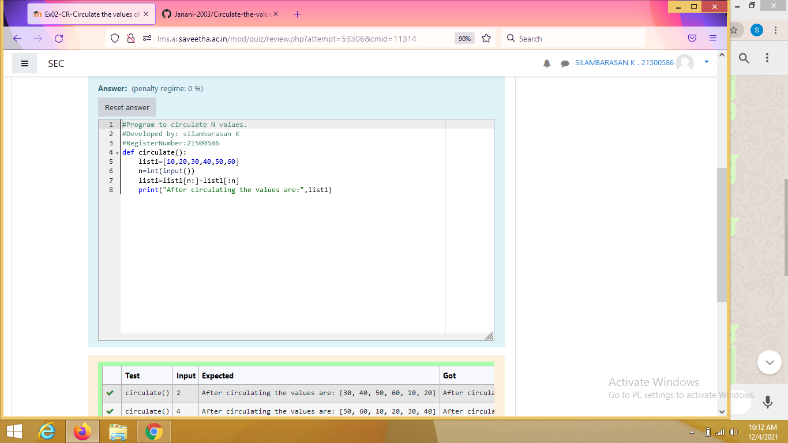

# Circulate-the-values-of-N-variables
## Aim:
To write a python program to circulate the n variables using function concept
## Equipment’s required:
PC
Anaconda - Python 3.7
## Algorithm: 
## Step 1:
define a function

## Step 2:
prepare the lists from each circulate the values and assign in np.arrsay()

## Step 3:
Get the value from the user for the number of rotation

## Step 4:
Using the slicing concept rotate the list


## Program:
```
def circulate():
    list1=[10,20,30,40,50,60]
    n=int(input())
    list1=list1[n:]+list1[:n]
print("After circulating the values are:",list1)
```
## Output:

## Result:
Thus circulate the n variables using function concept is successfully executed
